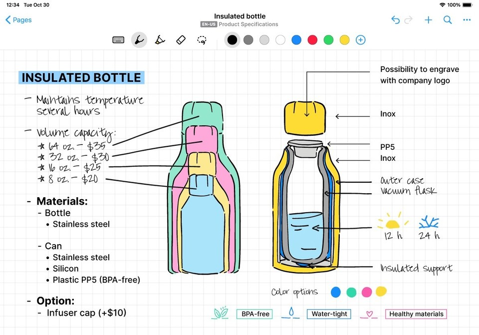

  

  
  

  
  

 

## 📚 목차
1. [프론트엔드 역할](#1-프론트엔드-역할)  
2. [기술 스택](#2-기술-스택)  
3. [프로젝트 구조](#3-프로젝트-구조)  
4. [주요 화면](#4-주요-화면)  
5. [데이터 처리 방식](#5-데이터-처리-방식)  
6. [실행 방법](#6-실행-방법)

 

##  1. 프론트엔드 역할
- 사용자 화면(UI) 구성 및 라우팅
- 로그인 상태 유지(localStorage 기반)
- 노트/퀴즈/로드맵 등 학습 흐름 화면 제공
- 로딩/에러/빈 상태 처리

 

##  2. 기술 스택
- React (Create React App)
- TypeScript
- react-router-dom
- @uiw/react-md-editor, @uiw/react-markdown-preview (마크다운 에디터/프리뷰)
- diff-match-patch (노트 비교)

 

##  3. 프로젝트 구조
프론트 프로젝트는 `daepang-main/` 아래에 있습니다.

<pre>
Daepang-front
└─ daepang-main
   ├─ public/
   │  ├─ view1.png
   │  └─ view2.png
   ├─ src/
   │  ├─ api/
   │  │  └─ mock.ts              # localStorage 기반 mock API
   │  ├─ components/             # Header/Footer/공용 UI
   │  ├─ data/                   # certs 등 정적 데이터
   │  ├─ pages/                  # 라우팅 단위 페이지
   │  ├─ types.ts
   │  ├─ App.tsx
   │  └─ index.tsx
   └─ package.json
</pre>

 

##  4. 주요 화면
- Home / Search / Community
- Login / Signup / Profile
- UploadNote / AllNotes / MyNotes / OtherNotes / NoteDetail
- CompareNotes (노트 비교)
- Quiz / ReviewDetail
- StudyRoadmap / Certs / CertDetail
- AIWorkbench (실험/작업용 페이지)

 

##  5. 데이터 처리 방식
현재 버전은 화면 흐름과 기능 검증을 위해 **localStorage 기반 mock API**를 사용합니다.  
관련 코드는 `src/api/mock.ts`에 정리되어 있습니다.

- 노트/퀴즈/진행도/좋아요/즐겨찾기 등을 mock으로 저장/조회
- 로그인 상태는 localStorage의 `isLoggedIn` 값으로 관리(App.tsx)

 

##  6. 실행 방법
<pre>
git clone https://github.com/ZonezIpex/Daepang-front
cd Daepang-front/daepang-main
npm install
npm start
</pre>

 

### 참고
- CRA 기반이라 기본 스크립트는 `start / build / test / eject`를 사용합니다.
